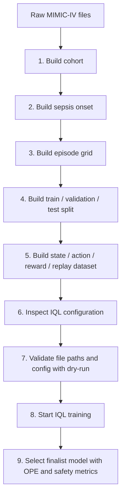

# MIMIC Sepsis IQL Offline RL

This is a research codebase that converts a Sepsis-3-based intensive care cohort from MIMIC-IV into 4-hour MDP steps and performs retrospective offline RL policy learning with Implicit Q-Learning (IQL).

This repository is not a clinical decision support system. Its purpose is to provide a leakage-safe and reproducible IQL benchmark workflow that learns from recorded clinician decisions without live interaction with patient data.

## Contents

- [Features](#features)
- [Requirements](#requirements)
- [Data and Safety Notes](#data-and-safety-notes)
- [Installation](#installation)
- [Quick Start](#quick-start)
- [Pipeline Diagram](#pipeline-diagram)
- [Full Data Pipeline](#full-data-pipeline)
- [IQL Training](#iql-training)
- [IQL Results](#iql-results)
- [Documentation](#documentation)
- [Troubleshooting](#troubleshooting)
- [Development](#development)
- [License](#license)
- [Citations](#citations)

## Features

- Adult ICU patient cohort generation based on Sepsis-3 criteria.
- 4-hour episode grid construction over the onset -24 hours to +48 hours window.
- `state_dim = 62` clinical features and 25 discrete treatment actions.
- Interpretable action coding as 5 vasopressor bins x 5 IV fluid bins.
- Leakage-safe preprocessing with patient-level train/validation/test splits.
- Value, critic, and actor training for IQL; expectile regression and advantage-weighted actor update workflow.
- IQL sweep, finalist selection, and OPE/safety evaluation with sparse and SOFA-shaped reward variants.
- Reproducible runtime environment based on `uv`, Hydra, MLflow, Polars, PyArrow, scikit-learn, PyTorch, and d3rlpy.

## Requirements

| Requirement | Version / Note |
| --- | --- |
| Python | `>=3.12` |
| Package manager | `uv` |
| Raw data | MIMIC-IV v3.1 files |
| Training runtime | PyTorch `2.6.0`, default index uses CUDA 12.4 wheels |
| Optional tools | `snakemake`, `pytest`, `ruff`, `jupyter` in the dev group |

Dependencies are pinned with `pyproject.toml` and `uv.lock`. Use `uv sync` during installation instead of manually installing package lists.

## Data and Safety Notes

- This repository does not contain patient data.
- MIMIC-IV use requires authorized PhysioNet access and the required CITI training.
- Raw data is expected under:

```text
data/raw/physionet.org/files/mimiciv/3.1
```

- Treat the contents of `data/raw/` as immutable; do not modify raw files with code.
- Generated artifacts are stored under `data/processed/`, `data/splits/`, `data/replay/`, `results/iql_final/`, `runs/`, and `checkpoints/`.
- The IQL policy should be interpreted only for retrospective research and benchmarking purposes.

## Installation

```bash
git clone <repo-url>
cd mimic-sepsis-drl
uv sync
```

To verify the installation:

```bash
uv run python -m mimic_sepsis_rl.training.device --self-check
```

Success signal: the Python environment starts, the PyTorch device is reported, and the self-check completes without errors.

## Quick Start

If raw data and previously generated cohort/onset/episode/split files are ready, run the minimum workflow for IQL:

```bash
uv run python -m mimic_sepsis_rl.cli.build_transitions
uv run python -m mimic_sepsis_rl.training.device --self-check
uv run python -m mimic_sepsis_rl.training.experiment_runner --algorithm iql --describe
uv run python -m mimic_sepsis_rl.training.experiment_runner --algorithm iql --dry-run
uv run python -m mimic_sepsis_rl.training.experiment_runner --algorithm iql
```

Expected success signal: replay files are read, the IQL config is reported, the dry-run completes without errors, and training artifacts are written to the IQL run directories.

## Pipeline Diagram

The Mermaid diagram below summarizes the ordered steps from raw MIMIC-IV files to IQL evaluation outputs.



## Full Data Pipeline

The sequence below gives the reproducible data workflow from raw MIMIC-IV files to the IQL replay dataset.

### 1. Build Cohort

```bash
uv run python -m mimic_sepsis_rl.cli.build_cohort \
  --config configs/cohort/default.yaml \
  --emit-audit
```

Expected outputs:

- `data/processed/cohort/cohort.parquet`
- `data/processed/cohort/excluded.parquet`
- `data/processed/cohort/audit.json`

### 2. Build Sepsis Onset

```bash
uv run python -m mimic_sepsis_rl.data.onset \
  --config configs/onset/default.yaml
```

Expected outputs:

- `data/processed/onset/onset_assignments.parquet`
- `data/processed/onset/onset_candidates.parquet`
- `data/processed/onset/unusable_episodes.parquet`
- `data/processed/onset/onset_audit.json`

### 3. Build Episode Grid

```bash
uv run python -m mimic_sepsis_rl.cli.build_episode_grid
```

Expected outputs:

- `data/processed/episodes/episodes.parquet`
- `data/processed/episodes/episode_steps.parquet`
- `data/processed/episodes/grid_audit.json`

### 4. Build Train / Validation / Test Split

```bash
uv run python -m mimic_sepsis_rl.data.splits \
  --config configs/splits/default.yaml \
  --source-episode-set data/processed/episodes/episodes.parquet
```

Expected outputs:

- `data/splits/train_manifest.parquet`
- `data/splits/validation_manifest.parquet`
- `data/splits/test_manifest.parquet`
- `data/splits/split_summary.json`

### 5. Build State / Action / Reward / Replay Dataset

```bash
uv run python -m mimic_sepsis_rl.cli.build_transitions
```

Expected main outputs:

- `data/processed/features/state_vectors/state_table_raw.parquet`
- `data/processed/features/state_vectors/state_table_normalized.parquet`
- `data/processed/features/train_medians.json`
- `data/processed/features/state_vectors/preprocessing_artifacts.json`
- `data/processed/actions/action_bins.json`
- `data/processed/actions/step_actions.parquet`
- `data/processed/rewards/reward_config.json`
- `data/processed/rewards/step_rewards.parquet`
- `data/replay/replay_train.parquet`
- `data/replay/replay_train_meta.json`
- `data/replay/replay_validation.parquet`
- `data/replay/replay_validation_meta.json`
- `data/replay/replay_test.parquet`
- `data/replay/replay_test_meta.json`

## IQL Training

Inspect the target configuration before IQL training:

```bash
uv run python -m mimic_sepsis_rl.training.experiment_runner \
  --algorithm iql \
  --describe
```

Validate file paths and configuration without side effects:

```bash
uv run python -m mimic_sepsis_rl.training.experiment_runner \
  --algorithm iql \
  --dry-run
```

Start training:

```bash
uv run python -m mimic_sepsis_rl.training.experiment_runner --algorithm iql
```

Do not make IQL evaluation decisions based on a single loss value. Model selection should interpret FQE/WIS, ESS, support mass, clinician agreement, low-support rate, and safety flags together.

## IQL Results

| Output | Link | Note |
| --- | --- | --- |
| Final report | [results/iql_final/final_report.md](results/iql_final/final_report.md) | Stage 2 selected checkpoint and baseline comparison |
| Final metrics | [results/iql_final/final_metrics.json](results/iql_final/final_metrics.json) | Selected IQL run summary |
| Final comparison | [results/iql_final/final_comparison.csv](results/iql_final/final_comparison.csv) | Baseline and selected IQL table data |
| Pre-sweep audit | [results/iql_final/audit/presweep_audit.json](results/iql_final/audit/presweep_audit.json) | Data leakage and pipeline audit result |
| Stage 1 manifest | [results/iql_final/stage1/stage1_manifest.json](results/iql_final/stage1/stage1_manifest.json) | Initial sweep manifest |
| Stage 2 summary | [results/iql_final/stage2/stage2_summary.json](results/iql_final/stage2/stage2_summary.json) | Repeated-seed finalist summary |
| Selection rationale | [results/iql_final/stage1/selection/selection_rationale.md](results/iql_final/stage1/selection/selection_rationale.md) | Finalist selection notes |
| Graphics catalog | [docs/iql_graphics_catalog.md](docs/iql_graphics_catalog.md) | What the IQL figures show |

Selected configuration in the final Stage 2 report: `iql_sofa_shaped_conservative_safe`. The reported metrics are FQE 2.848, WIS 8.203, WIS 95% CI 4.963-10.817, ESS 29.4, and support mass 0.991.

Main figures:

- [results/iql_final/figures/fqe_vs_support.png](results/iql_final/figures/fqe_vs_support.png)
- [results/iql_final/figures/seed_variance.png](results/iql_final/figures/seed_variance.png)
- [results/iql_final/figures/action_heatmap.png](results/iql_final/figures/action_heatmap.png)
- [results/iql_final/figures/baseline_comparison.png](results/iql_final/figures/baseline_comparison.png)
- [results/iql_final/figures/bootstrap_ci.png](results/iql_final/figures/bootstrap_ci.png)

## Documentation

| Category | Document | Link |
| --- | --- | --- |
| IQL protocol | Final hyperparameter sweep protocol | [docs/iql_final_sweep_protocol.md](docs/iql_final_sweep_protocol.md) |
| IQL graphics | Graphics catalog | [docs/iql_graphics_catalog.md](docs/iql_graphics_catalog.md) |
| IQL proposal | Project proposal | [docs/proje_onerisi_iql.md](docs/proje_onerisi_iql.md) |
| Cohort | Cohort selection rules | [docs/cohort_selection.md](docs/cohort_selection.md) |
| Features | Feature dictionary | [docs/feature_dictionary.md](docs/feature_dictionary.md) |
| Actions | Action mapping and discretization | [docs/action_mapping.md](docs/action_mapping.md) |
| Rewards | Reward specification | [docs/reward_spec.md](docs/reward_spec.md) |
| Training | Pipeline and RL positioning | [docs/pipeline_rl_positioning.md](docs/pipeline_rl_positioning.md) |
| Evaluation | Evaluation protocol | [docs/evaluation_protocol.md](docs/evaluation_protocol.md) |
| Reproducibility | Reproducibility guide | [docs/reproducibility.md](docs/reproducibility.md) |
| Safety | Leakage boundaries | [docs/leakage_boundaries.md](docs/leakage_boundaries.md) |

## Troubleshooting

| Symptom | Possible cause | Solution |
| --- | --- | --- |
| `data/raw/physionet.org/files/mimiciv/3.1` cannot be found | Raw MIMIC-IV files have not been downloaded or are in a different location | Verify your PhysioNet access and place the files in the expected directory. |
| IQL dry-run cannot find the replay file | `build_transitions` has not been run or an intermediate pipeline step is missing | Follow the sequence in the `Full Data Pipeline` section. |
| IQL metrics look inconsistent | A different reward, seed, split, or preprocessing setup was used | Check `results/iql_final/audit/presweep_audit.json` and `docs/iql_final_sweep_protocol.md`. |
| High FQE but low support | The policy may be drifting toward actions with weak data support | Interpret FQE together with ESS, support mass, low-support rate, and clinician agreement. |
| PyTorch device error | CUDA/MPS environment incompatibility or wrong wheel | Validate the runtime with `uv run python -m mimic_sepsis_rl.training.device --self-check`. |

## Development

To install development dependencies:

```bash
uv sync --group dev
```

Run tests:

```bash
uv run pytest
```

Code quality check:

```bash
uv run ruff check .
```

For pipeline automation, inspect the `Snakefile` and `scripts/` directory.

## License

Source code and documentation are licensed under the MIT License. See [LICENSE.md](LICENSE.md) for the full component-based license declaration.

MIMIC-IV-derived artifacts, raw data, checkpoints, generated results, and model release files may be subject to separate MIMIC-IV, PhysioNet, research-use, or model-release terms and are not independently relicensed by the MIT code license.

## Citations

Reference the following sources in studies produced with the MIMIC-IV dataset.

**MIMIC-IV Dataset**

> Johnson, A., Bulgarelli, L., Pollard, T., Gow, B., Moody, B., Horng, S., Celi, L. A., & Mark, R. (2024). MIMIC-IV (version 3.1). PhysioNet. RRID:SCR_007345. https://doi.org/10.13026/kpb9-mt58

**MIMIC-IV Publication**

> Johnson, A.E.W., Bulgarelli, L., Shen, L. et al. MIMIC-IV, a freely accessible electronic health record dataset. Sci Data 10, 1 (2023). https://doi.org/10.1038/s41597-022-01899-x

**PhysioNet Standard Citation**

> Goldberger, A., Amaral, L., Glass, L., Hausdorff, J., Ivanov, P. C., Mark, R., ... & Stanley, H. E. (2000). PhysioBank, PhysioToolkit, and PhysioNet: Components of a new research resource for complex physiologic signals. Circulation [Online]. 101 (23), pp. e215-e220. RRID:SCR_007345.
