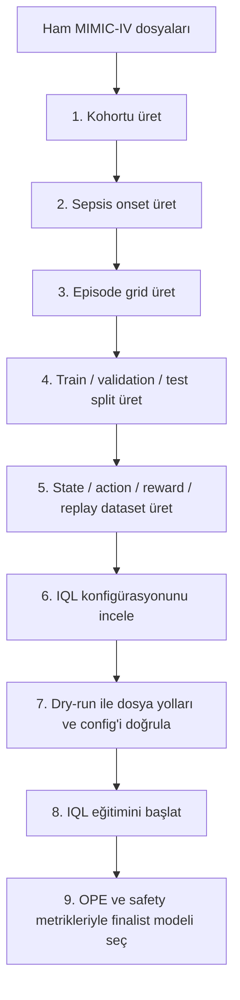

# MIMIC Sepsis IQL Offline RL

MIMIC-IV üzerinde Sepsis-3 tabanlı yoğun bakım kohortunu 4 saatlik MDP adımlarına dönüştüren ve Implicit Q-Learning (IQL) ile retrospektif offline RL politika öğrenimi yapan araştırma kod tabanıdır.

Bu repo klinik karar destek sistemi değildir. Amacı, hasta verisiyle canlı etkileşim kurmadan kayıtlı klinisyen kararlarından, veri sızıntısına karşı korumalı ve yeniden üretilebilir bir IQL benchmark akışı sağlamaktır.

## İçerik

- [Özellikler](#özellikler)
- [Gereksinimler](#gereksinimler)
- [Veri ve Güvenlik Notları](#veri-ve-güvenlik-notları)
- [Kurulum](#kurulum)
- [Hızlı Başlangıç](#hızlı-başlangıç)
- [Pipeline Diyagramı](#pipeline-diyagramı)
- [Tam Veri Pipeline'ı](#tam-veri-pipelineı)
- [IQL Eğitimi](#iql-eğitimi)
- [IQL Sonuçları](#iql-sonuçları)
- [Dokümantasyon](#dokümantasyon)
- [Sorun Giderme](#sorun-giderme)
- [Geliştirme](#geliştirme)
- [Atıflar](#atıflar)

## Özellikler

- Sepsis-3 kriterlerine göre yetişkin ICU hasta kohortu üretimi.
- Onset -24 saat ile +48 saat aralığında 4 saatlik episode grid oluşturma.
- `state_dim = 62` klinik özellik ve 25 ayrık tedavi aksiyonu.
- Aksiyonların 5 vazopressor bin'i x 5 IV fluid bin'i olarak yorumlanabilir şekilde kodlanması.
- Hasta seviyesinde train/validation/test ayrımı ile leakage-safe preprocessing.
- IQL için value, critic ve actor eğitimi; expectile regression ve advantage-weighted actor update akışı.
- Sparse ve SOFA-shaped reward varyantlarıyla IQL sweep, finalist seçimi ve OPE/safety değerlendirmesi.
- `uv`, Hydra, MLflow, Polars, PyArrow, scikit-learn, PyTorch ve d3rlpy tabanlı tekrarlanabilir çalışma ortamı.

## Gereksinimler

| Gereksinim | Sürüm / Not |
| --- | --- |
| Python | `>=3.12` |
| Paket yöneticisi | `uv` |
| Ham veri | MIMIC-IV v3.1 dosyaları |
| Eğitim runtime'ı | PyTorch `2.6.0`, varsayılan index CUDA 12.4 wheel'leri |
| Opsiyonel araçlar | `snakemake`, `pytest`, `ruff`, `jupyter` dev grubunda |

Bağımlılıklar `pyproject.toml` ve `uv.lock` ile sabitlenir. Kurulumda manuel paket listesi yerine `uv sync` kullanın.

## Veri ve Güvenlik Notları

- Bu repo hasta verisi barındırmaz.
- MIMIC-IV kullanımı için PhysioNet üzerinden yetkili erişim ve gerekli CITI eğitimi gerekir.
- Ham veri şu dizinde beklenir:

```text
data/raw/physionet.org/files/mimiciv/3.1
```

- `data/raw/` içeriğini immutable kabul edin; ham dosyaları kodla değiştirmeyin.
- Üretilen artifaktlar `data/processed/`, `data/splits/`, `data/replay/`, `results/iql_final/`, `runs/` ve `checkpoints/` altında tutulur.
- IQL politikası yalnızca retrospektif araştırma ve benchmark amacıyla yorumlanmalıdır.

## Kurulum

```bash
git clone <repo-url>
cd mimic-sepsis-drl
uv sync
```

Kurulumu doğrulamak için:

```bash
uv run python -m mimic_sepsis_rl.training.device --self-check
```

Başarı sinyali: Python ortamı açılır, PyTorch cihazı raporlanır ve self-check hata vermeden tamamlanır.

## Hızlı Başlangıç

Ham veri ve daha önce üretilmiş kohort/onset/episode/split dosyaları hazırsa IQL için minimum akışı çalıştırın:

```bash
uv run python -m mimic_sepsis_rl.cli.build_transitions
uv run python -m mimic_sepsis_rl.training.device --self-check
uv run python -m mimic_sepsis_rl.training.experiment_runner --algorithm iql --describe
uv run python -m mimic_sepsis_rl.training.experiment_runner --algorithm iql --dry-run
uv run python -m mimic_sepsis_rl.training.experiment_runner --algorithm iql
```

Beklenen başarı sinyali: replay dosyaları okunur, IQL config'i raporlanır, dry-run hata vermez ve eğitim artifaktları IQL run dizinlerine yazılır.

## Pipeline Diyagramı

Aşağıdaki Mermaid diyagramı, ham MIMIC-IV dosyalarından IQL değerlendirme çıktılarına kadar adımları sırayla özetler.



## Tam Veri Pipeline'ı

Aşağıdaki sıra, ham MIMIC-IV dosyalarından IQL replay veri setine kadar yeniden üretilebilir veri akışını verir.

### 1. Kohortu üret

```bash
uv run python -m mimic_sepsis_rl.cli.build_cohort \
  --config configs/cohort/default.yaml \
  --emit-audit
```

Beklenen çıktılar:

- `data/processed/cohort/cohort.parquet`
- `data/processed/cohort/excluded.parquet`
- `data/processed/cohort/audit.json`

### 2. Sepsis onset üret

```bash
uv run python -m mimic_sepsis_rl.data.onset \
  --config configs/onset/default.yaml
```

Beklenen çıktılar:

- `data/processed/onset/onset_assignments.parquet`
- `data/processed/onset/onset_candidates.parquet`
- `data/processed/onset/unusable_episodes.parquet`
- `data/processed/onset/onset_audit.json`

### 3. Episode grid üret

```bash
uv run python -m mimic_sepsis_rl.cli.build_episode_grid
```

Beklenen çıktılar:

- `data/processed/episodes/episodes.parquet`
- `data/processed/episodes/episode_steps.parquet`
- `data/processed/episodes/grid_audit.json`

### 4. Train / validation / test split üret

```bash
uv run python -m mimic_sepsis_rl.data.splits \
  --config configs/splits/default.yaml \
  --source-episode-set data/processed/episodes/episodes.parquet
```

Beklenen çıktılar:

- `data/splits/train_manifest.parquet`
- `data/splits/validation_manifest.parquet`
- `data/splits/test_manifest.parquet`
- `data/splits/split_summary.json`

### 5. State / action / reward / replay dataset üret

```bash
uv run python -m mimic_sepsis_rl.cli.build_transitions
```

Beklenen ana çıktılar:

- `data/processed/features/state_vectors/state_table_raw.parquet`
- `data/processed/features/state_vectors/state_table_normalized.parquet`
- `data/processed/features/train_medians.json`
- `data/processed/features/state_vectors/preprocessing_artifacts.json`
- `data/processed/actions/action_bins.json`
- `data/processed/actions/step_actions.parquet`
- `data/processed/rewards/reward_config.json`
- `data/processed/rewards/step_rewards.parquet`
- `data/replay/replay_train.parquet`
- `data/replay/replay_train_meta.json`
- `data/replay/replay_validation.parquet`
- `data/replay/replay_validation_meta.json`
- `data/replay/replay_test.parquet`
- `data/replay/replay_test_meta.json`

## IQL Eğitimi

IQL eğitiminden önce hedef konfigürasyonu inceleyin:

```bash
uv run python -m mimic_sepsis_rl.training.experiment_runner \
  --algorithm iql \
  --describe
```

Dosya yollarını ve konfigürasyonu yan etkisiz şekilde doğrulayın:

```bash
uv run python -m mimic_sepsis_rl.training.experiment_runner \
  --algorithm iql \
  --dry-run
```

Eğitimi başlatın:

```bash
uv run python -m mimic_sepsis_rl.training.experiment_runner --algorithm iql
```

IQL değerlendirmesinde tek loss değeriyle karar vermeyin. Model seçimi FQE/WIS, ESS, support mass, clinician agreement, low-support rate ve safety flag'leri birlikte yorumlanarak yapılmalıdır.

## IQL Sonuçları

| Çıktı | Link | Not |
| --- | --- | --- |
| Final rapor | [results/iql_final/final_report.md](results/iql_final/final_report.md) | Stage 2 seçilen checkpoint ve baseline karşılaştırması |
| Final metrikler | [results/iql_final/final_metrics.json](results/iql_final/final_metrics.json) | Seçilen IQL run özeti |
| Final karşılaştırma | [results/iql_final/final_comparison.csv](results/iql_final/final_comparison.csv) | Baseline ve selected IQL tablo verisi |
| Pre-sweep audit | [results/iql_final/audit/presweep_audit.json](results/iql_final/audit/presweep_audit.json) | Veri sızıntısı ve pipeline audit sonucu |
| Stage 1 manifest | [results/iql_final/stage1/stage1_manifest.json](results/iql_final/stage1/stage1_manifest.json) | İlk sweep manifesti |
| Stage 2 summary | [results/iql_final/stage2/stage2_summary.json](results/iql_final/stage2/stage2_summary.json) | Tekrarlanan seed finalist özeti |
| Seçim gerekçesi | [results/iql_final/stage1/selection/selection_rationale.md](results/iql_final/stage1/selection/selection_rationale.md) | Finalist seçim notları |
| Grafik kataloğu | [docs/iql_graphics_catalog.md](docs/iql_graphics_catalog.md) | IQL grafiklerinin ne anlattığı |

Final Stage 2 raporundaki seçili konfigürasyon: `iql_sofa_shaped_conservative_safe`. Raporlanan metrikler FQE 2.848, WIS 8.203, WIS 95% CI 4.963-10.817, ESS 29.4 ve support mass 0.991 şeklindedir.

Ana görseller:

- [results/iql_final/figures/fqe_vs_support.png](results/iql_final/figures/fqe_vs_support.png)
- [results/iql_final/figures/seed_variance.png](results/iql_final/figures/seed_variance.png)
- [results/iql_final/figures/action_heatmap.png](results/iql_final/figures/action_heatmap.png)
- [results/iql_final/figures/baseline_comparison.png](results/iql_final/figures/baseline_comparison.png)
- [results/iql_final/figures/bootstrap_ci.png](results/iql_final/figures/bootstrap_ci.png)

## Dokümantasyon

| Kategori | Doküman | Link |
| --- | --- | --- |
| IQL protocol | Final hyperparameter sweep protocol | [docs/iql_final_sweep_protocol.md](docs/iql_final_sweep_protocol.md) |
| IQL graphics | Grafik kataloğu | [docs/iql_graphics_catalog.md](docs/iql_graphics_catalog.md) |
| IQL proposal | Proje önerisi | [docs/proje_onerisi_iql.md](docs/proje_onerisi_iql.md) |
| Cohort | Cohort selection rules | [docs/cohort_selection.md](docs/cohort_selection.md) |
| Features | Feature dictionary | [docs/feature_dictionary.md](docs/feature_dictionary.md) |
| Actions | Action mapping and discretization | [docs/action_mapping.md](docs/action_mapping.md) |
| Rewards | Reward specification | [docs/reward_spec.md](docs/reward_spec.md) |
| Training | Pipeline and RL positioning | [docs/pipeline_rl_positioning.md](docs/pipeline_rl_positioning.md) |
| Evaluation | Evaluation protocol | [docs/evaluation_protocol.md](docs/evaluation_protocol.md) |
| Reproducibility | Reproducibility guide | [docs/reproducibility.md](docs/reproducibility.md) |
| Safety | Leakage boundaries | [docs/leakage_boundaries.md](docs/leakage_boundaries.md) |

## Sorun Giderme

| Belirti | Olası neden | Çözüm |
| --- | --- | --- |
| `data/raw/physionet.org/files/mimiciv/3.1` bulunamıyor | Ham MIMIC-IV dosyaları indirilmemiş veya farklı yerde | PhysioNet erişiminizi doğrulayın ve dosyaları beklenen dizine yerleştirin. |
| IQL dry-run replay dosyası bulamıyor | `build_transitions` çalışmadı veya ara pipeline eksik | `Tam Veri Pipeline'ı` bölümündeki sırayı takip edin. |
| IQL metrikleri tutarsız görünüyor | Farklı reward, seed, split veya preprocessing kullanıldı | `results/iql_final/audit/presweep_audit.json` ve `docs/iql_final_sweep_protocol.md` dosyalarını kontrol edin. |
| Yüksek FQE ama düşük support | Politika veri desteği zayıf aksiyonlara kayıyor olabilir | FQE'yi ESS, support mass, low-support rate ve clinician agreement ile birlikte yorumlayın. |
| PyTorch cihaz hatası | CUDA/MPS ortam uyumsuzluğu veya yanlış wheel | `uv run python -m mimic_sepsis_rl.training.device --self-check` komutuyla runtime'ı doğrulayın. |

## Geliştirme

Geliştirme bağımlılıklarını kurmak için:

```bash
uv sync --group dev
```

Testleri çalıştırın:

```bash
uv run pytest
```

Kod kalitesi kontrolü:

```bash
uv run ruff check .
```

Pipeline otomasyonu için `Snakefile` ve `scripts/` dizinini inceleyin.

## Atıflar

MIMIC-IV veri seti ile üretilen çalışmalarda aşağıdaki kaynakları referans verin.

**MIMIC-IV Dataset**

> Johnson, A., Bulgarelli, L., Pollard, T., Gow, B., Moody, B., Horng, S., Celi, L. A., & Mark, R. (2024). MIMIC-IV (version 3.1). PhysioNet. RRID:SCR_007345. https://doi.org/10.13026/kpb9-mt58

**MIMIC-IV Publication**

> Johnson, A.E.W., Bulgarelli, L., Shen, L. et al. MIMIC-IV, a freely accessible electronic health record dataset. Sci Data 10, 1 (2023). https://doi.org/10.1038/s41597-022-01899-x

**PhysioNet Standard Citation**

> Goldberger, A., Amaral, L., Glass, L., Hausdorff, J., Ivanov, P. C., Mark, R., ... & Stanley, H. E. (2000). PhysioBank, PhysioToolkit, and PhysioNet: Components of a new research resource for complex physiologic signals. Circulation [Online]. 101 (23), pp. e215-e220. RRID:SCR_007345.

