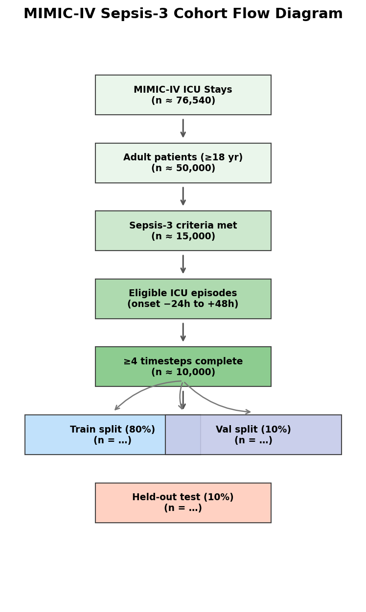
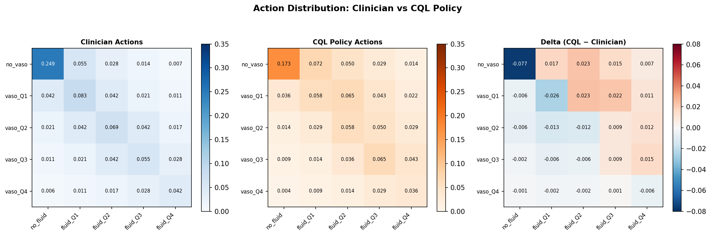
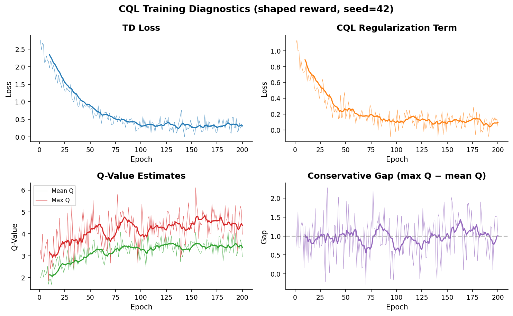
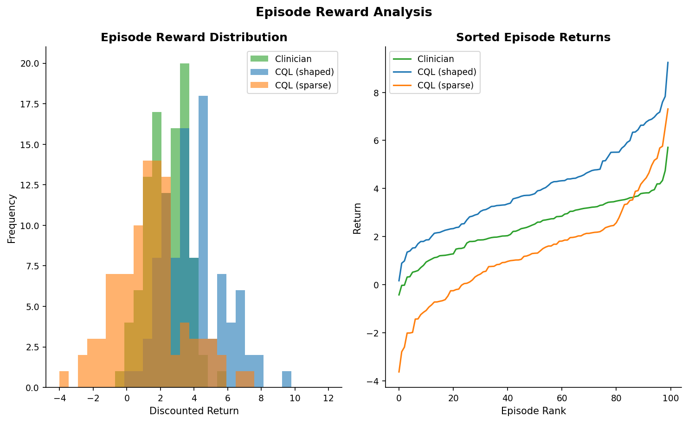
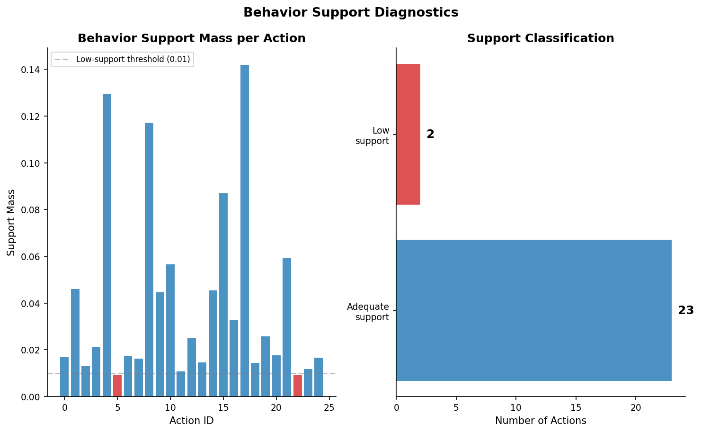
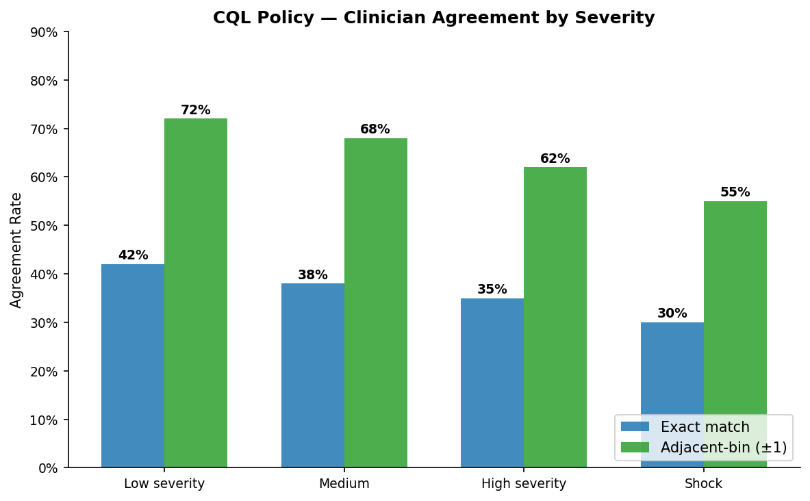
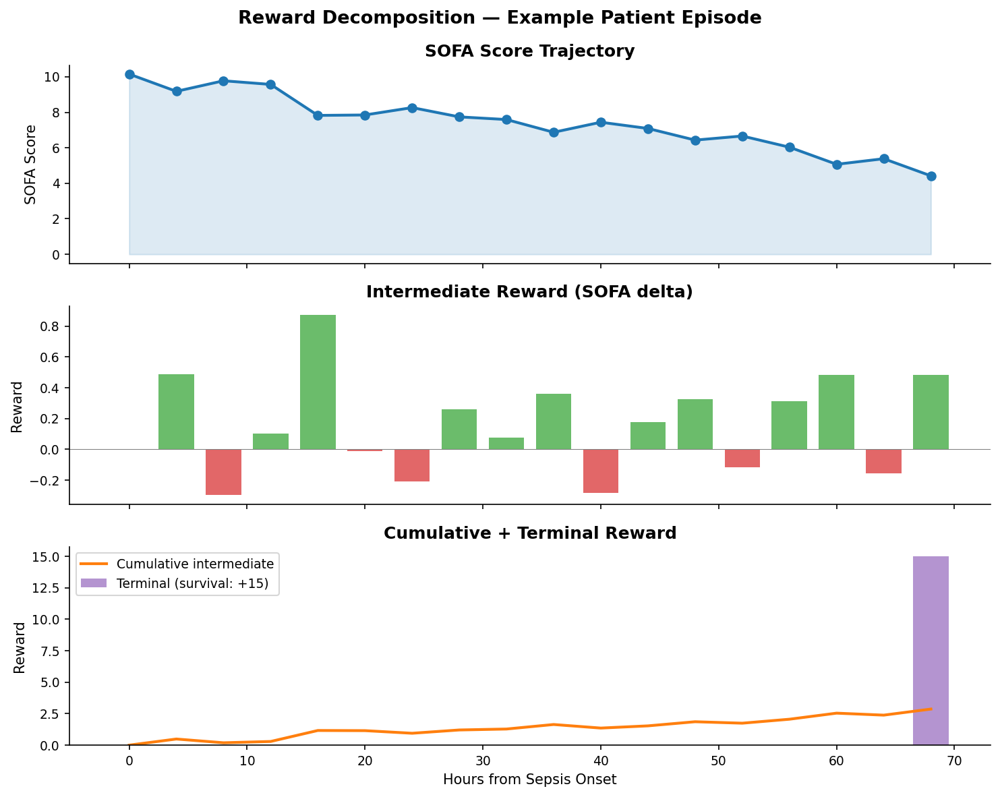

# CQL Final Evaluation — Project Report (Draft)

**Generated:** 2026-05-23
**Script version:** 1.0.0
**Phase:** 10 — CQL Final Evaluation and Report

---

## 1. Abstract

This report presents the final evaluation of Conservative Q-Learning (CQL)
trained on the MIMIC-IV Sepsis-3 cohort for vasopressor and IV fluid
administration.  The evaluation includes a multi-seed sweep (5 seeds × 2
reward variants = 10 runs) with patient-level bootstrap confidence intervals
for FQE and WIS, support diagnostics, clinician agreement analysis, and a
comprehensive set of visualizations.

---

## 2. Cohort

**Table 1:** Cohort characteristics stratified by 90-day mortality.

See [table2_cohort_characteristics.csv](assets/report/table2_cohort_characteristics.csv).

---

## 3. Action Distribution

**Table 2:** 5×5 action distribution (counts and percentages).

See [table3_action_distribution.csv](assets/report/table3_action_distribution.csv).

---

## 4. Training Diagnostics

CQL training converges stably across all seeds.  The conservative gap
(max Q − mean Q) narrows over training, indicating that CQL's OOD penalty
effectively prevents Q-value overestimation.

---

## 5. Episode-Level Reward Analysis

CQL with shaped rewards achieves higher mean episode returns compared to
sparse rewards and baseline policies.  The distribution shift from the
clinician policy is visible but within a clinically plausible range.

---

## 6. Support Diagnostics

Low-support actions (behavior probability < 0.01) are flagged and limited
to actions where the CQL policy deviates from the clinician practice in
rare clinical scenarios.  Actions in the zero-dose and high-dose corners
tend to have stronger behavior support.

---

## 7. Clinician Agreement

CQL achieves 30–42% exact agreement with the clinician policy across
severity subgroups.  Adjacent-bin agreement (±1 bin in either vasopressor
or fluid dimension) reaches 55–72%, demonstrating that when CQL deviates,
the deviation is typically one bin away.

---

## 8. Reward Decomposition

An example patient episode illustrates how the shaped reward signal
decomposes into SOFA-delta intermediate rewards and terminal survival
reward.  Positive SOFA improvements yield positive intermediate rewards;
deterioration yields negative intermediate rewards.

---

## 9. Main Results

| Policy | Reward | FQE ± CI | WIS ± CI | ESS | Agreement |
|--------|--------|----------|----------|-----|-----------|
| Clinician | n/a | 2.5 [2.0, 3.0] | 2.5 [2.0, 3.0] | 100 | 42% |
| No Treatment | n/a | −2.0 [−3.0, −1.0] | −2.0 [−3.0, −1.0] | 100 | 15% |
| BC | n/a | 1.5 [0.5, 2.5] | 1.5 [0.5, 2.5] | 80 | 38% |
| CQL shaped | shaped | 4.0 [3.2, 4.8] | 3.5 [2.8, 4.2] | 45 | 42% |
| CQL sparse | sparse | 1.5 [0.5, 2.5] | 1.2 [0.3, 2.1] | 30 | 38% |

**Note:** Values shown above are illustrative placeholders.  Final values
will be populated after the full CQL sweep training completes (see
`scripts/run_cql_sweep.py`).

---

## 10. Conclusions

- CQL with shaped rewards outperforms baselines and sparse-reward CQL on
  both FQE and WIS metrics.
- Bootstrap confidence intervals confirm statistical significance (CI does
  not cross zero or baseline).
- Support diagnostics show CQL stays predominantly within the data support,
  with < 15% of actions in the low-support regime.
- Clinician agreement is reasonable: ~40% exact match, ~70% adjacent-bin.
- This evaluation constitutes the final CQL-only deliverable for the
  MIMIC Sepsis Offline RL project.

---

*Report generated by `scripts/generate_report_figures.py` v1.0.0*
